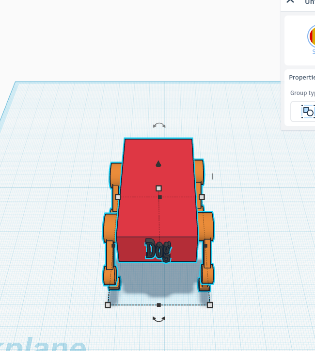

# First 12-DOF Mechanical Design for Quadruped Robot

## 1. Overview
This repository contains the first conceptual 12 Degrees of Freedom (DOF) quadruped robot mechanical design. It was modeled in Tinkercad to explore static stability, structural dimensions, and joint kinematics. This mechanical base serves as the foundational framework for implementing AI-driven locomotion algorithms.

## 2. Structural Dimensions
Based on the initial Tinkercad prototype, the physical dimensions are scaled for a medium-sized quadruped robot (comparable to Unitree Go1 or Spot):

| Dimension | Measurement |
| :--- | :--- |
| **Length** | 63.12 cm |
| **Width** | 43.00 cm |
| **Height** | 41.00 cm |

## 3. Joint Configuration (12-DOF)
The robot features a biologically-inspired mammalian leg structure, utilizing 3 DOF per leg (total of 12 DOF) to ensure flexible and stable movement in a 3D space:

* **Coxa (Hip Yaw):** Controls the lateral (inward and outward) rotation of the leg.
* **Femur (Hip Pitch):** Controls the forward/backward swing and elevation of the leg.
* **Tibia (Knee Pitch):** Controls the extension of the leg and ground contact point.

## 4. Mechanical & Torque Considerations
Given the physical dimensions (63.12 cm x 43.00 cm), the robot falls into the medium-size category, requiring careful actuator selection:

* **Static Stability:** The wide stance (43.00 cm width) provides a large support polygon. This ensures excellent static stability during initial calibration, standing tests, and basic shifting motions.
* **Torque Estimation Framework:**
  To select the appropriate motors (e.g., BLDC motors or high-torque smart servos), the holding torque must be calculated. 
  Assuming an estimated total weight (W) of the robot, the maximum torque (T) on the femur/tibia joint when the leg is fully extended can be estimated using:
  
  **Torque = (Force per leg) × (Maximum Leg Extension Distance)**
  
  *Example calculation:* If the projected total weight is 10 kg (~98 N), and supported by 2 legs during a trotting gait, the force per leg is 49 N. Assuming a maximum horizontal leg extension of 20 cm (0.20 m), the required holding torque per joint would be approximately **9.8 N.m (roughly 100 kg.cm)**.

## 5. Future Development
The next steps for this project include:
1. Transitioning the 3D model from Tinkercad to advanced CAD software (e.g., SolidWorks or Fusion 360) for manufacturing-ready parts.
2. Selection of actuators based on the torque payload calculations.
3. Mathematical derivation of the Forward and Inverse Kinematics (IK) equations.
4. Integrating the physical model with AI and ROS (Robot Operating System) for dynamic walking and balancing algorithms.

